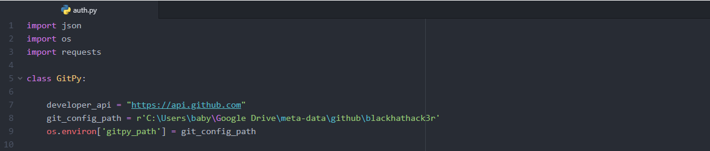

# gitpy

Python Interface to GitHub developer's API

---

[](https://travis-ci.org/babygame0ver/gitpy)
[](https://codeclimate.com/github/babygame0ver/gitpy)
[](https://codecov.io/gh/babygame0ver/gitpy)

---

## Dependencies

[](https://www.python.org/downloads/release/python-374/)
[](https://pypi.python.org/pypi/requests/)
[](https://pypi.org/project/coverage/)
[](https://pypi.org/project/codecov/)

---

## Installation Guide

```

# git clone https://github.com/babygame0ver/gitpy.git && cd gitpy
# pip install -r requirements.txt
# python3 setup.py install

```

## Run test suite

```
# python3 -m unittest discover
# coverage run -m unittest discover

```

---

A command line package purely written in Python3 consumes GitHub developer's API and provides all the functionalities in one place using Python Function.

* Core : Deals with authentication with GitHub API using Authentication token.

* Repository : Deals with information & actions related to both public & private Repositories.

---

## Documentation

### Initial Configuration for GitPy : Create a config.json file with Username and Token in Your System or Create env variable with Username and Token having values as username and token.

For config.json file you need to edit git_config_path in auth.py file as follow.

File Location for editing git_config_path: gitpy/core/auth.py



After Installation

.. code-block:: python

    from gitpy.core.auth import GitPy

    def authentication_module():
        config_data = GitPy.get_initial_configuration()
        print(config_data)
        g = GitPy(username = config_data['username'], token = config_data['token'])
        '''
        or
        g = GitPy(username = 'username',token = 'token')
        '''
        print(g.check_connectivity()) # Connected
        print(g.authorization()) # Authorization Successfull {username}

    def main():
        authentication_module()

    if __name__ == '__main__':
        main()
