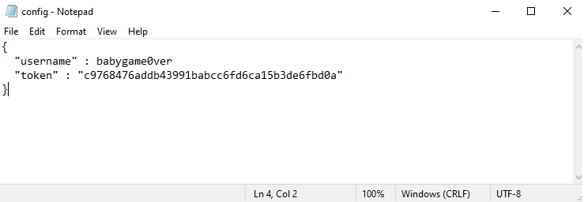

## Configuration Steps for Gitpy (Before Installation : 2 minutes)

Gitpy works on Username & Token of a GitHub Account. So it requires few configuration before Installation.

[Get your Personal Access Token for GitHub Account](https://help.github.com/en/github/authenticating-to-github/creating-a-personal-access-token-for-the-command-line)

For configuration we have two methods available.

## Download gitpy

```
# git clone https://github.com/babygame0ver/gitpy.git && cd gitpy

```

### Method 1. Using Configuration from Local File.

- Create a File with username and token & name it config.json .



- Copy the absolute path of config file from file system.


- Change the **git_config_path** variable in **gitpy/core/auth.py**


---

### Method 2. Creating Environment variable 'username' & 'token' in your machine.

- Obtain Access token from your GitHub Account.

- After obtaining Access token add your Username & Token to Environment variables in your Machine.

### For Windows

1. Username


2. Token


### For Linux/MAC

```
export username="yourgithubusername"
export token="yoursecretaccesstoken"
```
